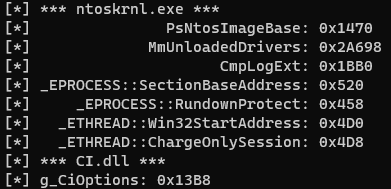

<p align="center"></p>
<p align="center">
  
  
  
</p>

# NtSymbol

Resolve DOS MZ executable symbols at runtime

# Example

You no longer have not have to use memory pattern scan inside your sneaky rootkit. Pass the RVAs into your kernel payloads!

```cpp
int main()
{
    ntsymbol ntoskrnl("%SYSTEMROOT%\\system32\\ntoskrnl.exe");
    ntoskrnl.init();
    /* Useful for retriving NTOS image base without any calls */
    const auto RvaPsNtosImageBase = ntoskrnl.resolve(L"PsNtosImageBase");
    
    
    ntsymbol cidll("%SYSTEMROOT%\\system32\\CI.dll");
    cidll.init();
    /* DSE Bypass! */
    const auto RvaCiOptions = cidll.resolve(L"g_CiOptions");
}
```
